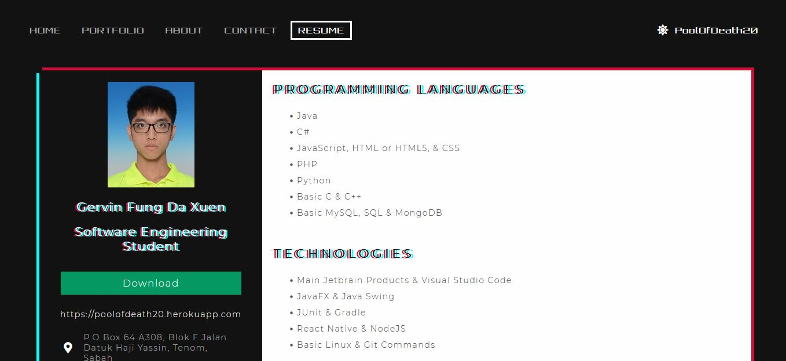

# This is basic simple webpage of mine

A website that contains some of my repositories on github
It is also a Progressive Web App

## Home Page

## Portfolio Page

No. | Repository
--- | ----
1.| A UTAR Rental Room by web scrapping from UTAR Accomodation List through collaboration with Eugene Yong
2.| LibGDX Chess Game that implements minimax AI. Playable against Human or AI & cross-platforms
3.| Javax Swing Chess Game that implements minimax AI. Playable against Human or AI
4.| Android Chess Game that implements minimax AI. Playable against Human or AI, albeit less features than desktop version
5.| Connect4 Game that implements minimax AI. Playable against Human or AI
6.| Javax Swing Tic Tac Toe Game that implements minimax AI. Playable against Human or AI
7.| A text editor similar to NotePad written with JavaFX
8.| A text editor similar to NotePad written with Java Swing
9.| Solving knapsack problems in 5 different ways
10.| A multithreaded console program to demonstrate simple threaded program
11.| A Playable Web Version of Tic Tac Toe Game through collaboration with Tay Ming Liang
12.| A simple C++ console program to work with files, OOP concepts and merge sort
13.| 9 sorting algorithms to sort a list or an array of integer
14.| A normal and simple python calculator

## About Page

## Contact Page

## Resume Page

