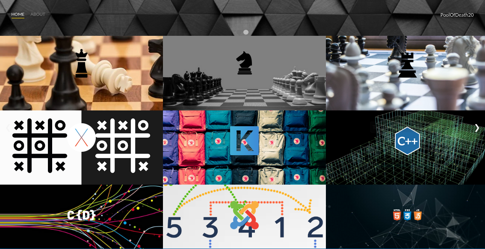
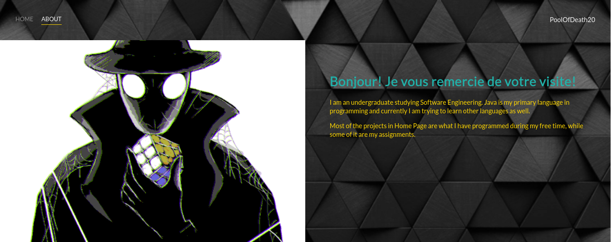

# This is basic simple webpage of mine

A website that contains some of my repositories on github

## Home Page

No. | Repository
--- | ----
1.| LibGDX Chess Game that implements minimax AI. Playable against Human or AI & cross-platforms
2.| Javax Swing Chess Game that implements minimax AI. Playable against Human or AI
3.| Android Chess Game that implements minimax AI. Playable against Human or AI, albeit less features than desktop version
4.| Javax Swing Tic Tac Toe Game that implements minimax AI. Playable against Human or AI
5.| Solving knapsack problems in 5 different ways
6.| A simple C++ console program to work with files, OOP concepts and merge sort
7.| A multithreaded console program to demonstrate simple threaded program
8.| 9 sorting algorithms to sort a list or an array of integer
9.| A simple website(This Website)
10.| A normal and simple python calculator
12.| A chess game that has no AI, and full of ugly code

## About Page

