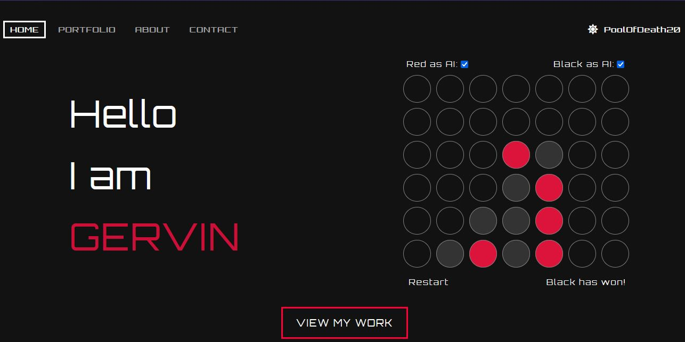
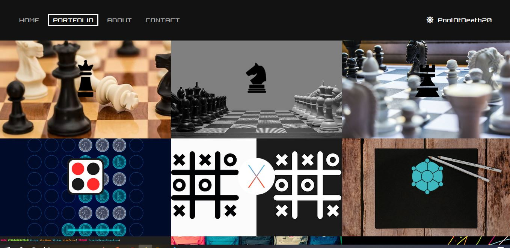
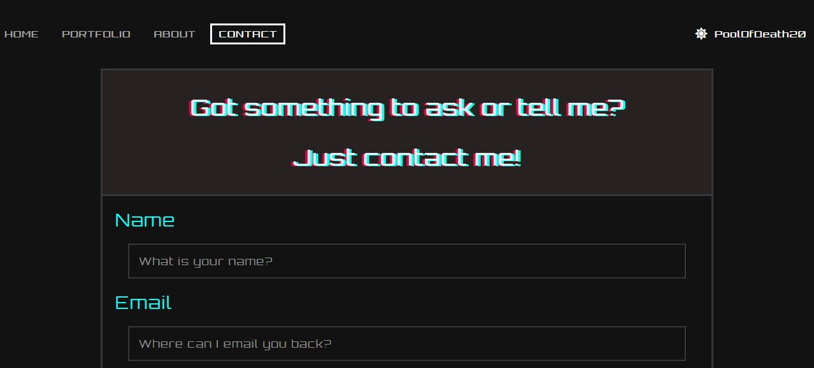

# This is basic simple webpage of mine

A website that contains some of my repositories on github
It is also a Progressive Web App

## Home Page

## Portfolio Page

No. | Repository
--- | ----
1.| LibGDX Chess Game that implements minimax AI. Playable against Human or AI & cross-platforms
2.| Javax Swing Chess Game that implements minimax AI. Playable against Human or AI
3.| Android Chess Game that implements minimax AI. Playable against Human or AI, albeit less features than desktop version
4.| Javax Swing Tic Tac Toe Game that implements minimax AI. Playable against Human or AI
5.| A text editor similar to NotePad written with JavaFX
6.| A text editor similar to NotePad written with Java Swing
7.| A simple website(This Website)
8.| A simple C++ console program to work with files, OOP concepts and merge sort
9.| Solving knapsack problems in 5 different ways
10.| A multithreaded console program to demonstrate simple threaded program
11.| 9 sorting algorithms to sort a list or an array of integer
12.| A normal and simple python calculator
13.| A chess game that has no AI, and full of ugly code

## About Page

## Contact Page

